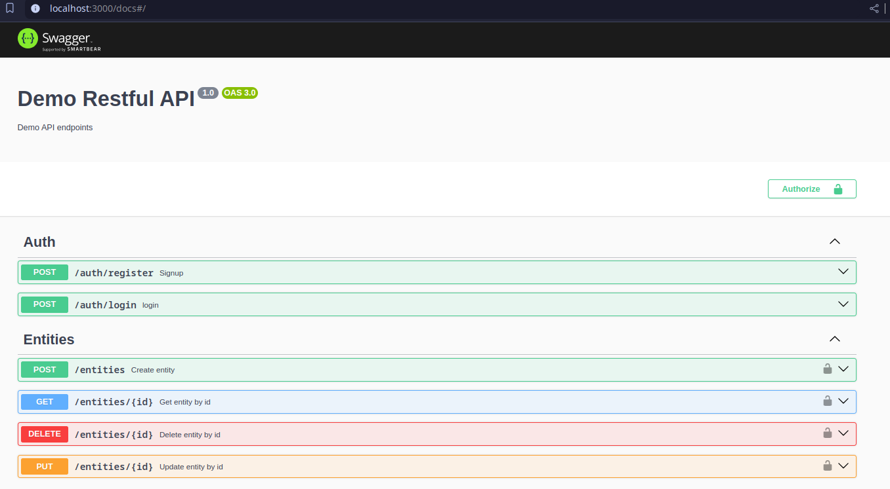

# NestJS + MongoDB Application

## Descripción

Este proyecto es una API construida con [NestJS](https://nestjs.com/) que utiliza una base de datos MongoDB para la gestión de datos. La aplicación ofrece endpoints para realizar operaciones CRUD sobre los recursos y cuenta con un sistema de autenticación basado en JWT, así como una documentación interactiva con Swagger.

## Requisitos

- Node.js (versión 18 o superior)
- MongoDB (local o en la nube)
- npm como gestor de dependencias
- En entorno local tener instalado docker y docker-compose (version 2.29 o superior)

## Instalación

1. Clona el repositorio:

   ```bash
   git clone https://github.com/lgualpa81/restful-nestjs-mongo-swagger.git
   ```

2. Ir al directorio del proyecto clonado

3. Ejecutar la aplicación localmente
   ```bash
   docker compose up -d
   ```
## Documentación del API

La documentación interactiva de la API está disponible en Swagger en la ruta /docs una vez que la aplicación esté en ejecución. Para acceder, abre tu navegador y ve a:

   ```bash
   http://localhost:3000/docs
   ```



## Estructura proyecto

```bash
├── assets
├── src
│   ├── modules
│   │   ├── auth
│   │   │   ├── decorators
│   │   │   ├── dto
│   │   │   ├── enums
│   │   │   ├── guards
│   │   │   └── strategies
│   │   ├── customers
│   │   │   ├── dto
│   │   │   └── schemas
│   │   ├── entities
│   │   │   ├── dto
│   │   │   └── schemas
│   │   ├── policies
│   │   │   ├── dto
│   │   │   └── schemas
│   │   ├── quotes
│   │   │   ├── dto
│   │   │   └── schemas
│   │   └── users
│   │       ├── dto
│   │       ├── errors
│   │       └── schemas
│   └── shared
│       ├── config
│       ├── helpers
│       ├── interfaces
│       └── pipes
└── test

```